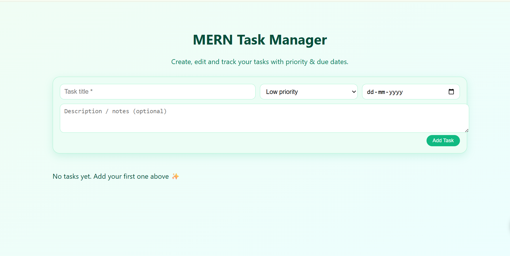
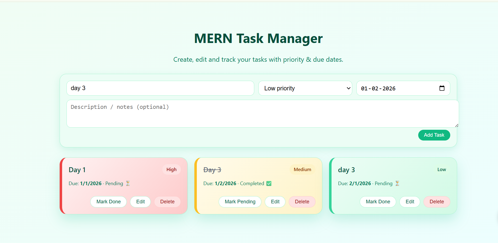
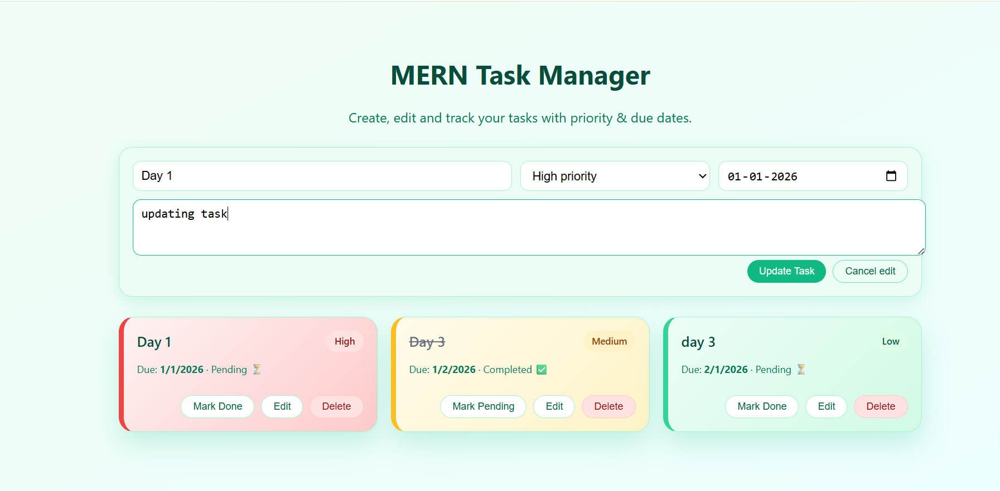
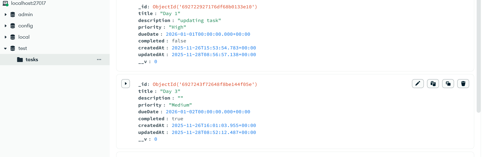

# MERN Task Manager  
**ProU Technology – Track 3 (Full-stack Development)**

---

##  Candidate Details

- **Name:** Venu Gopal  
- **Register Number:** 22BCE2829  
- **Personal Email:** venugopalvit2026@gmail.com  
- **College Email:** venu.gopal2022@vitstudent.ac.in  

---

##  Project Overview

This project is a **full-stack Task / Notes Manager** built as part of the **ProU Technology Online Assessment (Track 3 – Full-stack Development)**.

The application demonstrates the integration of:
- Frontend UI
- Backend REST APIs
- Database connectivity

Users can manage tasks/notes with rich metadata and an enhanced user interface.

---

##  Features

- Add new tasks / notes
- Edit existing tasks
- Delete tasks
- Mark tasks as completed or pending
- Priority selection (Low / Medium / High)
- Optional description and due date
- Card-based UI with pastel color palette
- Priority-based visual indicators
- Data persisted in MongoDB

---

##  Tech Stack Used

### Frontend
- React (Vite)
- HTML5, CSS3
- JavaScript (ES6+)

### Backend
- Node.js
- Express.js
- REST API architecture

### Database
- MongoDB (local instance)
- Mongoose ODM

---

##  Project Structure

mern-task-manager/
│
├── backend/
│ ├── server.js
│ ├── config/
│ │ └── db.js
│ ├── models/
│ │ └── Task.js
│ └── routes/
│ └── taskRoutes.js
│
├── frontend/
│ ├── index.html
│ ├── package.json
│ └── src/
│ ├── main.jsx
│ ├── App.jsx
│ ├── index.css
│ └── components/
│ ├── TaskForm.jsx
│ └── TaskItem.jsx
│
└── README.md

yaml
Copy code

---

##  Setup Instructions

###  Prerequisites
- Node.js (LTS recommended)
- npm
- MongoDB running locally
- (Optional) MongoDB Compass

---

###  Backend Setup

```bash
cd backend
npm install
Create a .env file inside the backend folder:

env
Copy code
MONGO_URI=mongodb://localhost:27017/test
PORT=5000
Start backend server:

bash
Copy code
npm run dev
Backend runs on:

arduino
Copy code
http://localhost:5000
🔹 Frontend Setup
bash
Copy code
cd frontend
npm install
npm run dev
Frontend runs on:

arduino
Copy code
http://localhost:5173
   API Endpoints
Base URL:

bash
Copy code
http://localhost:5000/api/tasks
Method	Endpoint	Description
GET	/api/tasks	Fetch all tasks
POST	/api/tasks	Create a new task
PUT	/api/tasks/:id	Update a task
DELETE	/api/tasks/:id	Delete a task

  Screenshots / Demo
Task list displayed as cards with priority colors
##  Screenshots

###  Home / Task List


###  Add Task


###  Edit Task


###  MongoDB Data



   Assumptions
Evaluator will run MongoDB locally.

.env file is not included for security reasons.

Database and collection are created automatically by Mongoose.

Authentication is not implemented as it was not explicitly required.

   Bonus / Enhancements
Improved UI with card-based layout

Pastel green themed design for better UX

Priority-based styling

Clean folder structure and reusable components

  Conclusion
This project demonstrates a complete frontend + backend + database workflow with clean code structure, readable APIs, and an improved user experience.

  Author
Venu Gopal
B.Tech Student – VIT
